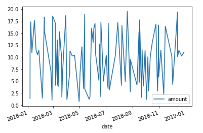
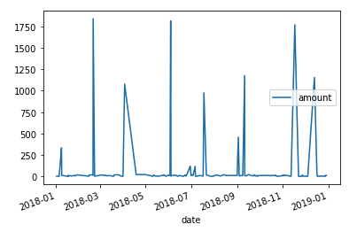
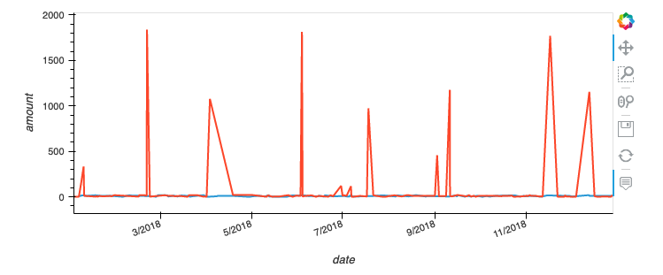
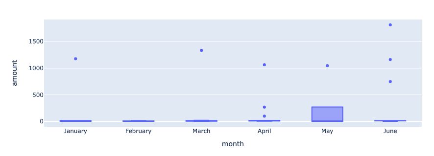

# Module-7-Challenge

## Data Analysis
### Part 1: 

* Some fraudsters hack a credit card by making several small transactions (generally less than $2), which are typically ignored by cardholders.
   * How can you isolate (or group) the transactions of each cardholder?
     * [Query sql](https://github.com/JD-Yue/Module-7-Challenge/blob/main/Data_Analysis_Part_1/1_1_complete_data.sql)
     * [Dataframe](https://github.com/JD-Yue/Module-7-Challenge/blob/main/Data_Analysis_Part_1/1_2_complete_data.csv)
   * Count the transactions that are less than $2.00 per cardholder.
     * [Query sql](https://github.com/JD-Yue/Module-7-Challenge/blob/main/Data_Analysis_Part_1/2_1_transactions_less_than_%242.sql)
     * [Dataframe](https://github.com/JD-Yue/Module-7-Challenge/blob/main/Data_Analysis_Part_1/2_3_count_less_than_%242.csv)
   * Is there any evidence to suggest that a credit card has been hacked? Explain your rationale.
     * It seems reasonable for customers to spend small amounts in the merchants provided in the morning (e.g., they may just buy a cup of coffee to start their day) so there is no sound evidence to suggest that a credit card has been hacked.

* Take your investigation a step further by considering the time period in which potentially fradulent transactions are made.
    * What are the top 100 transactions made between 7.00 am and 9.00 am?
      * [Query sql](https://github.com/JD-Yue/Module-7-Challenge/blob/main/Data_Analysis_Part_1/3_1_top_100_7-9.sql)
      * [Dataframe](https://github.com/JD-Yue/Module-7-Challenge/blob/main/Data_Analysis_Part_1/3_2_top_100_7_9.csv)
    * Do you see any anomalous transactions that could be fraudulent? 

      The following transactions could be fraudulent as it's not normal for spendings this big in the morning time by the customers.
      * $1,131 spent by Crystal Clark at Walker, Deleon and  (restaurant)
      * $1,617 spent by Crystal Clark at Mccarty-Thomas (bar)
      * $1,009 spent by Laurie Gibbs at Padilla-Clements (coffee shop)
      * $974 spent by Malik Carlson at Santos-Fitzgerald (pub)
      * $233 spent by Megan Price at Martin Inc. (restaurant)
      * $748 spent by Megan Price at Johnson-Fuller (pub)
      * $1,334 spent by Nancy Contreras at Griffin-Woodard (bar)
      * $100 spent by Nancy Contreras at Padilla-Clements (coffee shop)
      * $1,017 spent by Robert Johnson at Jacobs, Torres and W (bar)
      * $1,060 spent by Robert Johnson at Jenkins, Peterson and (restaurant)
      * $1,894 spent by Robert Johnson at Curry, Scott and Rich (bar)
      * $1,301 spent by Stephanie Dalton at Johnson-Fuller (pub)
      
      Such spendings are unusual especially for Laurie Gibbs, Malik Carlson and Stephanie Dalton (does not occur on a frequent basis).
   
    * Is there a higher number of fraudulent transactions made during this time frame versus the rest of the day?
      * [Query sql](https://github.com/JD-Yue/Module-7-Challenge/blob/main/Data_Analysis_Part_1/4_1_top_100_rest_of_day.sql)
      * [Dataframe](https://github.com/JD-Yue/Module-7-Challenge/blob/main/Data_Analysis_Part_1/4_2_top_100_rest_of_day.csv)

      There are far more larger value transactions during other times of the day. This makes sense, as the fancy, expensive corporate lunches and dinners take place later in the day. The transactions of such amounts are also normal to these customers (in the top spendings category). Thus there is no sound evidence to suggest that there is a higher number of fraudulent transactions made during this time frame.

* What are the top 5 merchants prone to being hacked using small transactions?
  * [Query sql](https://github.com/JD-Yue/Module-7-Challenge/blob/main/Data_Analysis_Part_1/5_1_top_5_merchants.sql)
  * [Dataframe](https://github.com/JD-Yue/Module-7-Challenge/blob/main/Data_Analysis_Part_1/5_2_top_5_merchants.csv)

  The top 5 merchants:
    * Wood-Ramirez
    * Baker Inc.
    * Hood-Phillips
    * Mcdaniel, Hines and 
    * Hamilton-Mcfarland

### Part 2:

* The two most important customers of the firm may have been hacked. Verify if there are any fraudulent transactions in their history. For privacy reasons, you only know that their cardholder IDs are 2 and 18.
    * Using hvPlot, create a line plot representing the time series of transactions over the course of the year for each cardholder separately.
      * Cardholder_2
      

        
      

      * Cardholder_18
      

        
      

    * Next, to better compare their patterns, create a single line plot that contains both card holders' trend data.
      

        
      

    * What difference do you observe between the consumption patterns? Does the difference suggest a fraudulent transaction? Explain your rationale.
     
    Cardholder 2's spendings averaged between $2 and $20 on a consistent basis but cardholder 18's purchases are mostly of large values. It is possible that cardholder 18 has been a victim of fraud as it seems that most of his/her credit card spendings are of large values.

* The CEO of the biggest customer of the firm suspects that someone has used her corporate credit card without authorization in the first quarter of 2018 to pay quite expensive restaurant bills. Again, for privacy reasons, you know only that the cardholder ID in question is 25.
    * Using hvPlot, create a box plot, representing the expenditure data from January 2018 to June 2018 for cardholder ID 25.
      

        
      

    * Are there any outliers for cardholder ID 25? How many outliers are there per month?

      There is one outlier in January, March and May, and three in April and June. 

